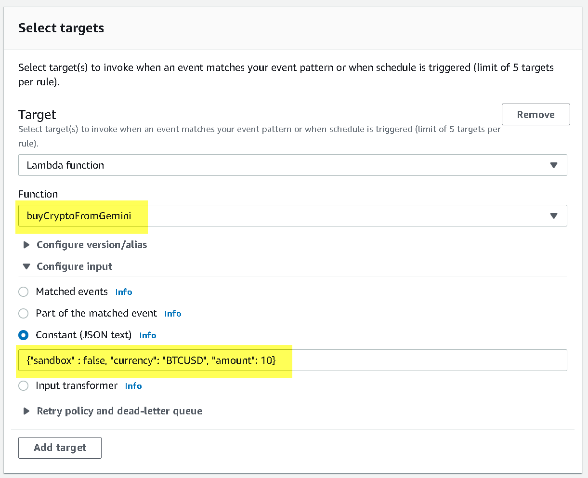
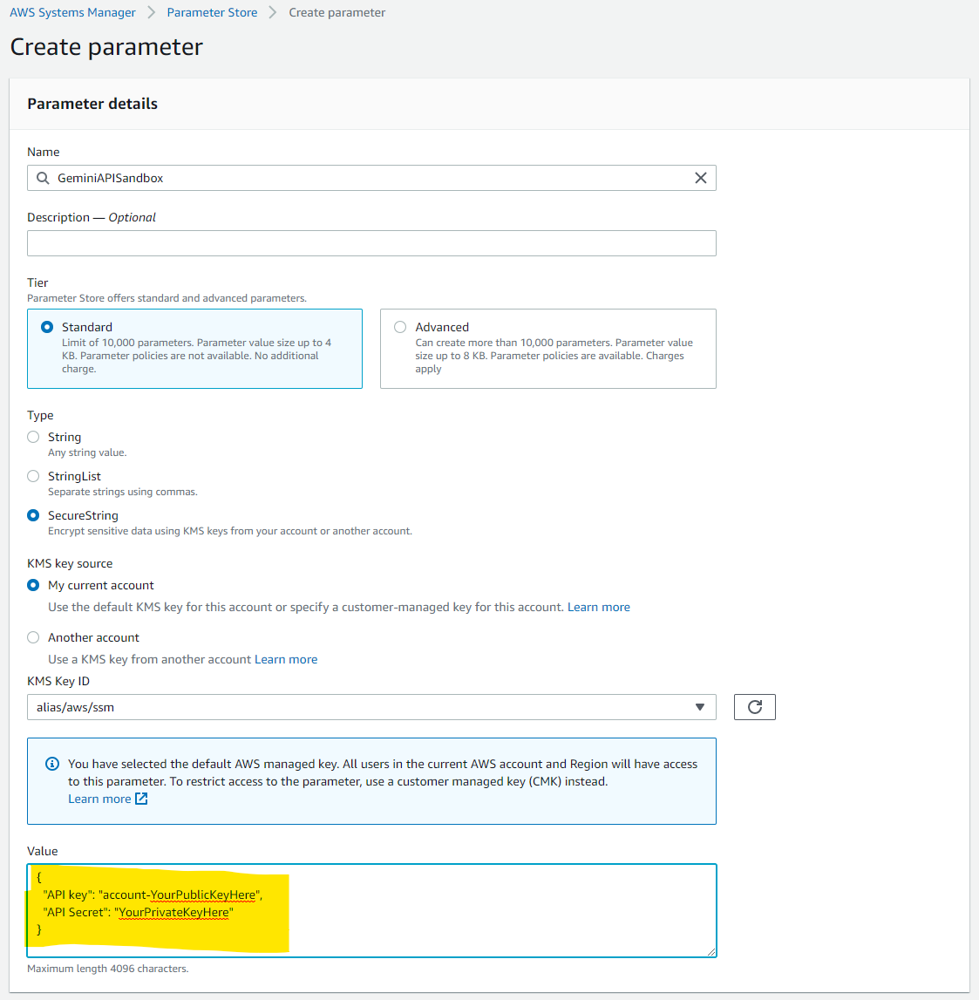
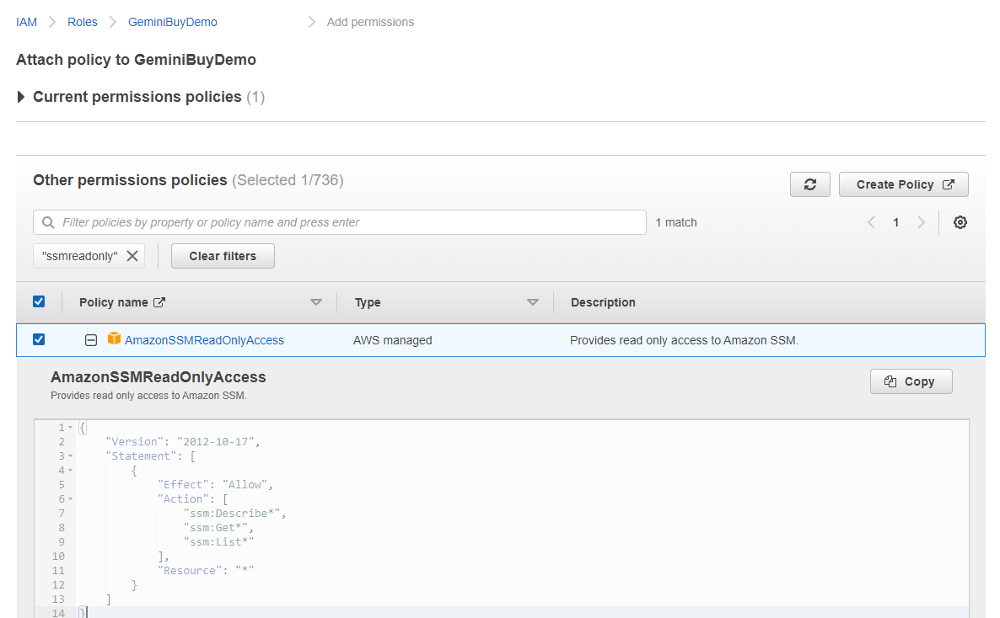

# The Why

**Dollar Cost Averaging** to reduce the impact of volatility on large purchases.

**Automating your investments** to free up your time for better things

**Low Fees** to keep more of your money

# The How

1. Follow along with <a href="https://www.youtube.com/watch?v=h6r1h3am6kA" target="_blank">this Youtube Video</a> (Thanks <a href="https://linktr.ee/RhettReisman">@Rhett</a>)
2. Gather the <a href="https://rhettre.notion.site/Gemini-API-Functions-for-AWS-abe92c33a13b4be19d232d5c91edfccf" target="_blank">needed resources here</a>.
3. Supplement the lambda functions with the ones in the repository. _Check back often for updates._

## Passing parameters to lambda functions
Instead of creating a lambda function for each different crypto (or price/coin combination) you can create a single _Event Bridge Rule_ and pass parameters to the function.



The required parameters are **sandbox**, **currency** and **amount**. Example:
```
{
   "sandbox" : false,
   "currency": "BTCUSD",
   "amount": 10
}
```
or
```
{
   "sandbox" : false,
   "currency": "ETHUSD",
   "amount": 5
}
```

An example of all of the currently supported parameters and their applicable default values.  

```
{
   "sandbox" : true,
   "orderFillFactor" : 0.999,
   "currency": "BTCUSD",
   "amount": 0,
   "includeFear" : false,
   "fearFloor" : 20,
   "fearMultiplier" : 1.5,
   "includeGreed" : false,
   "greedCeiling" : 80,
   "greedMultiplier" : 0.5
}
```

## Fear and Greed Index

The [Fear and Greed Index](https://alternative.me/crypto/fear-and-greed-index/) analyzes the current sentiment of the Bitcoin market and converts the data into a simple meter from 0 to 100. Zero means "Extreme Fear", while 100 means "Extreme Greed". The index is for BTC only and utilizes 5 metrics.
- Volatility (25 %)
- Market Momentum/Volume (25%)
- Social Media (15%)
- Surveys (15%) currently paused
- Dominance (10%)
- Trends (10%)


## Hiding API keys
Instead of pasting your public and private API keys directly into the lambda function they should be stored in the _AWS Systems Manager Parameter Store_.
1. Go to the AWS Systems Manager > Parameter Store https://console.aws.amazon.com/systems-manager/parameters/
2. Click _Create parameter_
3. Set the Secret name as `GeminiAPISandbox` or `GeminiAPI`
4. Select Tier: `Standard`
5. Select Type: `SecureString`
6. Select Data type: `text`
7. Enter your Gemini public and private key into the value box as show here



```
{
  "API key": "account-YourPublicKeyHere",
  "API Secret": "YourPrivateKeyHere"
}
```

8. Finally, modify the Lambda function execution role to have an updated IAM Role with access to the SSM keys. This can be done by going to the Lambda function's `Configuration > Permissions` page, and editing the role to add the `AmazonSSMReadOnlyAccess` policy.



```
{
    "Version": "2012-10-17",
    "Statement": [
        {
            "Effect": "Allow",
            "Action": [
                "ssm:Describe*",
                "ssm:Get*",
                "ssm:List*"
            ],
            "Resource": "*"
        }
    ]
}
```


# The Future
<a href="https://github.com/TheTallMan67/Gemini-API-Functions-for-AWS/discussions/new" target="_blank">Submit an Enhancement Request</a>

#  Bitcoin Accepted Here
**bc1qqyhxl0cjj885t7aqh5fmygxxclg4xketq0suaz**


